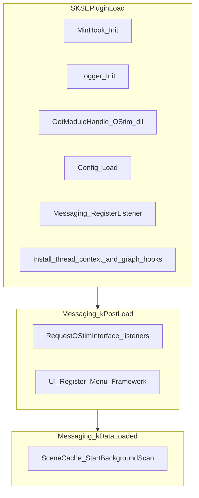

# Architecture (contributor reference)

This document describes how the **OStim Size Difference Manager** SKSE plugin is structured, how data flows at runtime, and where to change behaviour. Player-facing behaviour, install steps, and INI field tables live in `[README.md](../README.md)`.

**Primary references**

- In-repo layout summary: `[.cursor/rules/project-layout.mdc](../.cursor/rules/project-layout.mdc)`
- Windows / MSVC build pitfalls: `[.cursor/rules/build-and-toolchain.mdc](../.cursor/rules/build-and-toolchain.mdc)`

## Table of contents

1. [Primary entry points](#primary-entry-points)
2. [External dependencies](#external-dependencies)
3. [Repository layout](#repository-layout)
4. [Runtime lifecycle](#runtime-lifecycle)
5. [OStim integration (in-repo)](#ostim-integration-in-repo)
6. [Hooks and filtering](#hooks-and-filtering)
7. [Scene cache, matching, and persistence](#scene-cache-matching-and-persistence)
8. [Configuration](#configuration)
9. [UI (SKSE Menu Framework)](#ui-skse-menu-framework)
10. [Address resolution and OStim versions](#address-resolution-and-ostim-versions)
11. [OStimTypes and ABI](#ostimtypes-and-abi)
12. [Pitfalls and operational notes](#pitfalls-and-operational-notes)
13. [Change checklists](#change-checklists)
14. [Known limitations](#known-limitations)

## Primary entry points

| Path                                            | Role                                                                                                                                                               |
| ----------------------------------------------- | ------------------------------------------------------------------------------------------------------------------------------------------------------------------ |
| `skse/src/Main.cpp`                             | SKSE load: MinHook init, logger, optional early exit if `OStim.dll` missing, config load, messaging listener, hook installation, `kDataLoaded` scene scan kickoff. |
| `skse/src/Plugin.h`                             | `kPluginName`, `kPluginVersion` (used when requesting OStim NG thread API).                                                                                        |
| `skse/src/Hooks/ThreadContextHook.cpp`          | After `kPostLoad`: OStim interface exchange, `ThreadInterface` listener registration, per-thread scale capture into `Util/State`.                                  |
| `skse/src/Hooks/GetRandomNodeHook.cpp`          | MinHook on `Graph::GraphTable::getRandomNode` (initial / table-driven random node selection).                                                                      |
| `skse/src/Hooks/NavigationHook.cpp`             | MinHook on `Graph::Node::getRandomNodeInRange` (auto-progression style navigation).                                                                                |
| `skse/src/Hooks/MenuFilterHook.cpp`             | MinHook on `Graph::Navigation::fulfilledBy` (menu visibility for manual navigation).                                                                               |
| `skse/src/Hooks/FilterContext.cpp`              | Resolves OStim thread id for hooks; applies scope bypass (`ApplyToPlayerScenes`, `ApplyToNpcScenes`, `ApplyInAutoMode`).                                           |
| `skse/src/Hooks/RandomNodeTwoPass.h`            | Shared strict / soft / debug logic for the two random-node hooks.                                                                                                  |
| `skse/src/SceneCache/SceneLoader.cpp`           | Background thread: load overrides JSON, scan OStim scene JSON under `Data/`, populate `SceneCache::Cache`.                                                         |
| `skse/src/SceneCache/SceneCache.cpp`            | Thread-safe cache: match scenes to actor scales, exemptions, pack exemptions, overrides, autosave.                                                                 |
| `skse/src/Matching/HeightMatcher.cpp`           | `ComputeDiff` / `MatchesStrict` (max − min spread vs scene diff).                                                                                                  |
| `skse/src/Config/Config.cpp`                    | INI load/save for mode, tolerance, scope flags, `LogLevel`; creates INI if missing; UI-driven changes persist immediately.                                         |
| `skse/src/UI/Menu.cpp`                          | SKSE Menu Framework registration and ImGui pages.                                                                                                                  |
| `skse/src/AddressResolution/VersionGate.cpp`    | Reads `OStim.dll` PE version string; whitelist for hook installation.                                                                                              |
| `skse/src/AddressResolution/PdbResolver.cpp`    | Optional symbol → address resolution when debug symbols are available.                                                                                             |
| `skse/src/AddressResolution/PatternScanner.cpp` | Scans `OStim.dll` code sections for byte patterns from `data/SKSE/Plugins/OStimSizeDifferenceManager-Signatures.json`.                                                                        |
| `skse/src/OStimAPI/OStimInterface.h`            | Minimal vtable copy of OStim’s public `InterfaceExchange` / `ThreadInterface` ABI.                                                                                 |
| `skse/src/OStimAPI/OstimNGThreadAPI.h`          | Trimmed client declarations for `RequestPluginAPI_Thread` (thread id, auto mode, etc.).                                                                            |
| `skse/src/Util/State.cpp`                       | Per–OStim-thread actor scales, last active thread id, player thread id.                                                                                            |

## External dependencies

Runtime integration targets:

- **OStim NG** (standalone `OStim.dll`, scene JSON, public plugin interfaces): [https://github.com/VersuchDrei/OStimNG](https://github.com/VersuchDrei/OStimNG)  
Hook targets, calling conventions, and exported APIs must match the **released** `OStim.dll` you claim to support. Reconcile mangled names, patterns, and struct layouts against that binary (and upstream docs or sources in that repository as needed).
- **SKSE Menu Framework** (optional in-game settings UI): [https://github.com/QTR-Modding/SKSE-Menu-Framework-3](https://github.com/QTR-Modding/SKSE-Menu-Framework-3)  
This plugin loads `SKSEMenuFramework.dll` exports at runtime. The repo vendors a large `skse/src/UI/SKSEMenuFramework.h` so ImGui symbols resolve at compile time; keep that header aligned with the SMF version you expect players to use.

## Repository layout

| Area                    | Path                                                  | Notes                                                  |
| ----------------------- | ----------------------------------------------------- | ------------------------------------------------------ |
| Plugin sources          | `skse/src/`                                           | C++23; PCH `skse/src/PCH.h`.                           |
| Config                  | `skse/src/Config/`                                    | INI settings; immediate autosave on UI changes.         |
| Scene index + overrides | `skse/src/SceneCache/`                                | Scan + `Cache` + JSON persistence.                     |
| Hooks                   | `skse/src/Hooks/`                                     | MinHook trampolines and filter glue.                   |
| UI                      | `skse/src/UI/`                                        | `Menu.cpp` / `Menu.h`, vendored `SKSEMenuFramework.h`. |
| OStim-facing types      | `skse/src/OStimTypes/`                                | Layout mirrors used in hook signatures.                |
| OStim APIs              | `skse/src/OStimAPI/`                                  | Public ABI copies and NG thread API client.            |
| Matching                | `skse/src/Matching/`                                  | Pure height-diff math.                                 |
| Address resolution      | `skse/src/AddressResolution/`                         | Version gate, PDB, patterns.                           |
| State                   | `skse/src/Util/`                                      | `State.cpp`, `Logger.h`.                               |
| Ship patterns           | `data/SKSE/Plugins/OStimSizeDifferenceManager-Signatures.json`                   | Version-keyed byte patterns for pattern fallback.      |
| Build                   | `skse/CMakeLists.txt`, `skse/vcpkg.json`, `build.ps1` | Release build is the default; post-build copies DLL to `data/SKSE/Plugins/`. |

## Runtime lifecycle

1. `**SKSEPluginLoad**` (`skse/src/Main.cpp`): Initializes MinHook and logging. If `OStim.dll` is not loaded, the plugin returns `true` but skips hooks and OStim-specific setup (idle plugin). Otherwise loads config, registers the messaging listener, installs hooks (each hook file gates on known `OStim.dll` version), and logs which hooks succeeded.
2. `**kPostLoad**`: `RequestOStimInterface()` registers OStim thread lifecycle listeners. `UI::Register()` registers SKSE Menu Framework section items if the framework DLL is present.
3. `**kDataLoaded**`: `SceneCache::StartBackgroundScan()` detaches a worker thread that loads overrides, walks OStim scene JSON on disk, and calls `SceneCache::Get()->SetData(...)`.

## OStim integration (in-repo)

1. **Interface exchange** (`skse/src/Hooks/ThreadContextHook.cpp`, `skse/src/OStimAPI/OStimInterface.h`): On `kPostLoad`, the code dispatches OStim’s `InterfaceExchangeMessage` via `SKSE::GetMessagingInterface()->Dispatch`, reads `InterfaceMap*`, and `queryInterface("Threads")` for `ThreadInterface`.
2. **Listeners**: `registerThreadStartListener`, `registerNodeChangedListener`, `registerThreadStopListener` keep `Util/State` in sync with per-thread actor scales. Scales are computed as **race height × ref scale** (see `ScalesFromThread` in the same file).
3. **OStim NG thread API** (`skse/src/OStimAPI/OstimNGThreadAPI.h`, used from `skse/src/Hooks/FilterContext.cpp`): `GetAPI` resolves `RequestPluginAPI_Thread` from `OStim.dll`. Used for `GetPlayerThreadID` and `IsAutoMode` so scope flags match OStim even if listener-derived thread id is stale.

## Hooks and filtering

All graph hooks use **MinHook** (vcpkg package `minhook`; `MH_CreateHook` / `MH_EnableHook`). Each installer:

1. Reads `OStim.dll` PE version via `AddressResolution::GetOStimVersionString`.
2. Aborts if `AddressResolution::IsKnownGoodVersion` fails (unknown version → **no hooks** for graph functions; plugin still loads).
3. Resolves target address: **PDB symbol first** (`ResolveByPdbSymbol`), then **pattern** from `data/SKSE/Plugins/OStimSizeDifferenceManager-Signatures.json` (`ResolveByPattern`).

| Hook source                            | Hooked API (conceptual)             | Role                                                                                                                                                                          |
| -------------------------------------- | ----------------------------------- | ----------------------------------------------------------------------------------------------------------------------------------------------------------------------------- |
| `skse/src/Hooks/GetRandomNodeHook.cpp` | `Graph::GraphTable::getRandomNode`  | Filters random node picks at the graph table (initial selection paths that use the static method).                                                                            |
| `skse/src/Hooks/NavigationHook.cpp`    | `Graph::Node::getRandomNodeInRange` | Same two-pass filter for in-range random progression.                                                                                                                         |
| `skse/src/Hooks/MenuFilterHook.cpp`    | `Graph::Navigation::fulfilledBy`    | After the original predicate passes, optionally hides a navigation target for **Strict** mode when scales mismatch; **Soft** and **Debug** still show entries (with logging). |

**Random selection vs menu**

- `skse/src/Hooks/RandomNodeTwoPass.h` wraps the original callable: **Strict** adds a predicate so only cache-matching nodes are returned; if none, **Soft** gathers candidates and picks among smallest distance; **Debug** logs and falls back to unfiltered call; **Off** passes through in hook sources before calling the template.
- `MenuFilterHook.cpp` does **not** use `RandomNodeTwoPass`; it post-processes the boolean result of `fulfilledBy` using `SceneCache::Matches` and mode-specific rules.

**Thread context for hooks**

- `Filter::ResolveGraphHookThreadId` prefers `State::GetLastActiveThreadId()`, then OStim NG API `GetPlayerThreadID()`, then listener-tracked player thread id.
- `Filter::ResolveMenuHookThreadId` prefers API `GetPlayerThreadID()`, then listener id.
- `Filter::ShouldBypassFiltering` applies INI scope toggles using `CanonicalPlayerOStimThreadId()` so “player scene” detection stays consistent with the NG API. **Player scene** means `threadId == playerThread` (including OStim thread id **0** when that is the player thread); do not require non-zero ids.

**Grep-friendly log strings**

- `Installed getRandomNode hook`
- `Installed getRandomNodeInRange hook`
- `Installed Graph::Navigation::fulfilledBy hook`
- `Unknown OStim.dll version` (version gate)
- `Could not resolve` (resolution failure)
- `fulfilledBy:` (trace / info from menu hook)

## Scene cache, matching, and persistence

**Scan** (`skse/src/SceneCache/SceneLoader.cpp`): Recursively reads `Data/SKSE/Plugins/OStim/scenes/**/*.json`. For each file: parse `actors` array; each actor’s optional `scale` (default `1.0`); compute `minScale`, `maxScale`, `diff = max − min`, `packName` from first folder under `scenes/`. Scene id: lowercased `id` field if present, else lowercased stem.

**Cache** (`skse/src/SceneCache/SceneCache.cpp`):

- `Matches(sceneId, actorScales, tolerance)` — If cache not ready or no actor scales: **allow** (`true`). Exemptions and pack exemptions allow. Per-scene **override** treats stored value as max allowed **actor** spread: allows when `actorDiff <= override + tolerance`. Scene ids with prefix `**ostim`** (lowercase): **always allow** (hub / base navigation). If scene id **not** in index: allow iff `ComputeDiff(actorScales) <= tolerance` (equivalent to treating missing metadata as zero authored spread—only similar-sized actors pass). Indexed scenes: `MatchesStrict` on stored `diff`.
- `SoftDistanceFromActors` mirrors the same special cases for ordering in soft mode (`RandomNodeTwoPass`).

**Overrides file**: `Data/SKSE/Plugins/OStimSizeDifferenceManager_Overrides.json` — keys `exemptions`, `exemptPacks`, `overrides` (see `[README.md](../README.md)`). Loaded in `Cache::LoadUserOverrides`; written with debounced autosave from the UI (`Menu.cpp` calls `TryAutosave` / `FlushDirtyNow`). Mutex protects cache mutation; `revision` bumps on changes for UI snapshots.

**README vs implementation**: README prose may describe unknown scenes as “authored difference 0.0”. The **implemented** rule for unknown ids is the inequality above (`ComputeDiff(actorScales) <= tolerance`). When updating docs or tests, treat the code in `SceneCache::Cache::Matches` as authoritative.

## Configuration

- **INI** path (runtime, relative to game root): `Data/SKSE/Plugins/OStimSizeDifferenceManager.ini` (`skse/src/Config/Config.cpp`).
- Keys: `Mode` (0–3), `Tolerance`, `ApplyToPlayerScenes`, `ApplyToNpcScenes`, `ApplyInAutoMode`, `LogLevel`.
- `Config::Get()` is read from hooks and UI hot paths. `Load` writes a new INI when the file is missing. `SetFromSource(..., UI)` applies live settings from the menu and calls `Save` when values actually change. `Reload` / `Save` remain available for non-UI callers.

## UI (SKSE Menu Framework)

- `skse/src/UI/Menu.cpp`: `Register()` checks `SKSEMenuFramework::IsInstalled()` (filesystem check for `Data/SKSE/Plugins/SKSEMenuFramework.dll`). Sets section `"OStim Size Difference"` and adds `"General Settings"` and `"Exemptions & Overrides"` render callbacks.
- Shared `g_configDraft` keeps General and Exemptions tabs coherent; `Config::Set` applied when drawing.
- Exemptions page: `UpdateExemptionsPageLifecycle` reloads overrides on enter, debounced autosave while open, flush on leave.

## Address resolution and OStim versions

| Step              | Location                                                                                     |
| ----------------- | -------------------------------------------------------------------------------------------- |
| PE version string | `skse/src/AddressResolution/VersionGate.cpp` (`GetOStimVersionString`, `IsKnownGoodVersion`) |
| Whitelist         | Same file — extend when officially supporting a new `OStim.dll` build                        |
| PDB lookup        | `skse/src/AddressResolution/PdbResolver.cpp`                                                 |
| Pattern fallback  | `skse/src/AddressResolution/PatternScanner.cpp` + `data/SKSE/Plugins/OStimSizeDifferenceManager-Signatures.json`        |

Each supported PE version should have patterns for all three hooked symbols in `OStimSizeDifferenceManager-Signatures.json`. Mangled names embedded in hook `.cpp` files must match the MSVC ABI of the target OStim build when using PDB resolution.

## OStimTypes and ABI

Headers under `skse/src/OStimTypes/` provide layouts and method names used across hooks (`Graph::Node`, `Graph::Navigation`, `Trait::ActorCondition`, furniture types, etc.). If OStim’s C++ ABI changes, update these **together** with patterns / PDB strings and validate in game.

The hook targets pass MSVC STL types (`std::vector<Trait::ActorCondition>`, `std::function<bool(Graph::Node*)>`) by value, so the plugin must be built with the same release STL ABI as OStim. Use `build-release-msvc` for in-game testing and packaged builds. A debug build changes MSVC iterator/debug layout and can corrupt hook arguments, which was observed as empty actor-condition vectors, failed starting-scene selection, or missing menu options.

## Pitfalls and operational notes

1. **Build environment**: MSVC standard library headers require a Visual Studio developer environment or `vcvars64` in the shell session before CMake build (details in `.cursor/rules/build-and-toolchain.mdc`).
2. **Release ABI required**: Hooked OStim functions cross DLL boundaries with STL types by value. Debug builds are useful for compile checks only; validate behavior with `build-release-msvc` / `./build.ps1`.
3. **Unknown OStim version**: Hooks silently skip installation; logs show `Unknown OStim.dll version` and per-hook `Could not resolve` warnings.
4. **Verbose logging**: `ThreadContextHook.cpp` logs each actor’s scale breakdown at **info** level when threads start or nodes change — noisy during active scenes.
5. **`kPluginVersion` drift**: `skse/src/Plugin.h` string is passed into `OstimNG_API::Thread::GetAPI`; keep it meaningful relative to releases and README.
6. **No `OStim.dll` at load**: Early return in `Main.cpp` — no hooks, no interface exchange; plugin stays inert.
7. **Soft mode menu behaviour**: `MenuFilterHook.cpp` intentionally **shows** mismatched navigation entries in Soft mode so manual navigation stays available; random-node hooks still do closest-match logic.

## Change checklists

**If you change filtering rules**

- Update `skse/src/SceneCache/SceneCache.cpp` (`Matches`, `SoftDistanceFromActors`) and any call sites in `RandomNodeTwoPass.h` / `MenuFilterHook.cpp`.
- Sync user-facing wording in `README.md` if behaviour visible to players changes.

**If you change hooked OStim APIs or structs**

- Update `skse/src/OStimTypes/`, mangled names in hook installers, and `data/SKSE/Plugins/OStimSizeDifferenceManager-Signatures.json`.
- Re-run in-game tests on each whitelisted `OStim.dll` PE version.

**If you add support for a new OStim build**

1. Record the new `OStim.dll` **file version** (four-component string).
2. Add it to `kKnownVersions` in `skse/src/AddressResolution/VersionGate.cpp`.
3. Add three signature entries to `OStimSizeDifferenceManager-Signatures.json` (one per symbol) or verify PDB symbols still resolve.
4. Smoke-test: thread start, random scene pick, auto progression, navigation menu, INI scope flags.

**If you change menu or overrides persistence**

- Review `skse/src/UI/Menu.cpp` lifecycle and `SceneCache::TryAutosave` / `FlushDirtyNow` / `SaveUserOverrides`.

## Known limitations

See `[README.md](../README.md)` (Limitations) and `[TODO.md](../TODO.md)` for multi-actor scenes, ratio-based matching, hub transitions, OStim scaling interaction, and maintenance ideas.